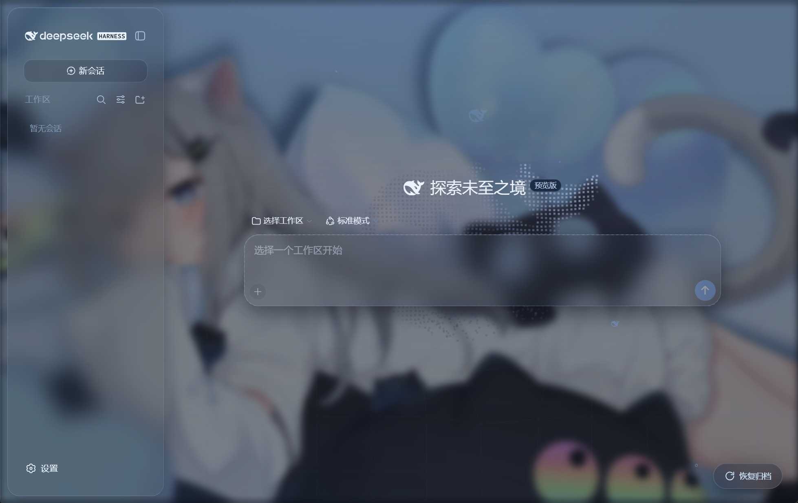

# Harness Desktop —— DeepSeek Harness 桌面版

Harness Desktop 是一个全新独立构建的 Windows 桌面客户端：它以 DeepSeek 官方开源的 [deepseek-harness](https://github.com/deepseek-ai/deepseek-harness) 为引擎，重新封装为桌面应用，并内置了一整套独具特色的玻璃拟态界面（Aqua）。软件开箱即用，用户无需安装 Node.js、Python 或任何开发环境。

说明：本项目不是 DeepSeek 官方出品，而是个人开发者基于官方开源项目二次构建的桌面封装。核心引擎 100% 来自官方开源代码，未改动官方功能，仅在其上增加「桌面化封装 + 内置主题」能力。

[](https://github.com/colm20060530/harness-desktop/releases)
[](LICENSE)



## 目录

1. [项目特色](#项目特色)
2. [功能特性](#功能特性)
3. [系统要求](#系统要求)
4. [适用人群](#适用人群)
5. [下载与安装](#下载与安装)
6. [快速开始](#快速开始)
7. [接入免费模型（示例一：Agnes AI）](#接入免费模型示例一agnes-ai)
8. [接入免费模型（示例二：智谱 GLM）](#接入免费模型示例二智谱-glm)
9. [数据与配置（含备份）](#数据与配置含备份)
10. [从源码构建](#从源码构建)
11. [项目结构](#项目结构)
12. [工作原理](#工作原理)
13. [自定义与打造你的专属桌面端](#自定义与打造你的专属桌面端)
14. [常见问题 FAQ](#常见问题-faq)
15. [许可证与致谢](#许可证与致谢)
16. [版本发布](#版本发布)

---

## 项目特色

### 全新独立构建，完整保留官方引擎

- 基于官方 `@deepseek-ai/dsh` 运行时封装，官方全部功能原样保留；
- 内置 Node.js 运行时与完整 dsh 服务端，双击即用，无需安装任何环境；
- 配置数据存放在应用自己的目录，与官方 `~/.dsh` 完全隔离，互不污染；
- 每次启动自动完成内置插件安装与自愈，插件无法被删除或破坏。

### 内置 Aqua 玻璃拟态 UI（本项目特色）

与官方 Web UI 相比，Harness Desktop 内置一套默认开启、不可卸载的玻璃拟态主题（Aqua）：

- **毛玻璃面板**：顶栏、侧边栏、输入区、统计栏、轨迹视图均为半透明毛玻璃卡片；
- **双模式**：Mica 模式将布局重排为悬浮玻璃卡片（模糊/霜化可调）；兼容模式保持官方布局不变，仅替换材质为玻璃，其他插件的界面同样获得统一质感；
- **动态背景**：内置流动流体背景（色相可调），亦支持自定义图片/视频壁纸（保留比例、模糊与霜化可调，重启后自动恢复）；
- **粒子鲸鱼**：deepseek.com/harness 同款粒子引擎 2D 移植版，悬浮于聊天区右侧；
- **质感细节**：深色模式下的侧边栏字标辉光铭牌、页面上下边缘渐隐、光标聚光与按压缩放等微交互；
- **一键还原**：设置 → 插件 → Glass theme 开关关闭后，界面 100% 还原官方原版（开关仅控制显隐，并非卸载插件）。

### 桌面化增强

| 特性 | 说明 |
| --- | --- |
| 即装即用 | 内置 Node.js 24 运行时与完整 dsh 服务端，无需预装 Node/npm/Python/浏览器 |
| 独立窗口 | 双击图标即用，告别浏览器标签页 |
| 自动拉起服务 | 启动时自动在本地拉起后端服务（默认固定端口 3080；异常退出遗留的服务自动回收） |
| 插件自愈 | 每次启动自动检查并修复内置插件，卸载无法持久 |
| 单实例运行 | 重复启动只聚焦已有窗口，不会产生第二个服务 |
| 关闭即清理 | 关闭窗口自动结束本地服务进程，不留残留 |
| 独立数据目录 | 默认数据存放于应用自己的目录，不污染官方 `~/.dsh` |
| 出厂默认观感 | 首次启动即深色模式 + 内置视频壁纸；玻璃模糊 16 / 磨砂 13 / 视频模糊 6 / 视频亮度 20 |
| 启动动画 | 启动等待期间播放深海主题开场动画 |
| 归档管理 | 右下角「恢复归档」面板：恢复、永久删除与批量管理已归档会话，删除需二次确认 |

### 完整智能体能力（官方引擎）

Harness Desktop 不是简单的聊天机器人，而是任务型 AI 智能体，可以：

- **读写文件**：查看、创建、修改工作目录中的文件；
- **执行命令**：运行 PowerShell、调用本机程序；
- **并行干活**：启动多个后台任务、派出多个子代理分工协作；
- **规划长任务**：把复杂目标拆成步骤清单逐项推进，完成后汇总报告；
- **输出成品**：文档、代码、报告、PPT、图表直接以文件形式产出到工作目录；
- **轨迹回放**：切换「轨迹」视图查看 AI 每一步的完整记录（Token 用量、耗时、输入输出），全程本地渲染；
- **沙箱权限**：默认只能访问你选择的工作目录，越界操作需逐次审批。

---

## 功能特性

| 类别 | 能力 |
| --- | --- |
| 对话 | 多会话管理、会话归档、归档恢复与批量管理（右下角「恢复归档」）、中英文输入、上下文连续追问 |
| 工具 | 文件读写、命令执行、网页搜索、子代理、后台任务、技能（Skills） |
| 规划 | 目标拆解（Goals）、计划模式（Plan）、步骤清单实时推进 |
| 视图 | 对话视图、轨迹视图（回放/时间轴/搜索/区间聚焦） |
| 安全 | 只读 / 工作区读写 / 完全访问三档沙箱、权限升级审批、失败即拒绝 |
| 模型 | 默认 DeepSeek 官方模型；支持 OpenAI 兼容协议接入任意服务商 |
| 扩展 | 插件化架构（Cordis），可安装插件、自定义命令与工具 |
| UI | Aqua 玻璃拟态（内置、默认开启、不可卸载）、图片/视频壁纸重启自动恢复、浅色/深色/跟随系统主题 |
| 识图 | 模型设置页内置 DeepSeek 识图提醒：可引导安装 ds-vision-skill，之后支持上传图片识别 |

---

## 系统要求

| 项目 | 要求 |
| --- | --- |
| 操作系统 | Windows 10 / Windows 11（64 位 x64；暂不支持 ARM 版、macOS、Linux） |
| 磁盘空间 | 安装约需 700 MB（安装包约 200 MB，含内置视频壁纸） |
| 内存 | 建议 4 GB 及以上 |
| 网络 | 软件启动与运行无需联网；与 AI 对话时需要联网调用模型服务商 API |
| 预装环境 | 无需 Node.js、npm、Python 或浏览器（全部内置） |

---

## 适用人群

| 人群 | 典型用法 |
| --- | --- |
| 程序员 / 开发者 | 让 AI 写代码、改 bug、跑脚本、重构项目、生成测试；Agent 可直接读写工作目录并执行命令 |
| 办公与知识工作者 | 写文档、周报、PPT、翻译、数据分析、资料整理，成果直接以文件产出 |
| AI 爱好者 / 折腾党 | 免费模型接入（Agnes、智谱 GLM 等）、插件化扩展、定制专属 UI 与桌面端 |
| 注重隐私的用户 | 所有数据默认只存本地，不与官方 `~/.dsh` 混用，卸载不影响官方环境 |
| 想拥有专属桌面端的用户 | 基于本项目 fork，换名字、换图标、换插件，重新打包成你自己的应用（见[自定义与打造你的专属桌面端](#自定义与打造你的专属桌面端)） |

不适合的场景：

- 只想简单聊天的用户：直接使用官方 Web UI 更轻量；
- macOS / Linux 用户：当前仅支持 Windows 10/11 x64；
- 需要企业级 SLA 与官方技术支持的用户：请使用 DeepSeek 官方产品与服务。

---

## 下载与安装

### 获取安装包

最新版本发布在 GitHub Releases：[下载页面](https://github.com/colm20060530/harness-desktop/releases)。本地源码仓库中也保留了 `release/` 目录：

| 文件 | 说明 |
| --- | --- |
| `Harness-Desktop-Setup-2.0.0.exe` | 安装版：向导安装、创建桌面/开始菜单快捷方式、可在「应用和功能」中卸载 |

Gitee 用户注意：Gitee Release 同步发布（[https://gitee.com/colm0530/harness-desktop/releases](https://gitee.com/colm0530/harness-desktop/releases)）。因 Gitee 单附件大小限制，安装包拆分为多个分卷上传，请下载全部分卷后按 Release 页说明合并（附 SHA-256 校验值）；GitHub Releases 提供免合并的完整版。

### 安装步骤

1. 双击 `Harness-Desktop-Setup-2.0.0.exe`；
2. 若出现 SmartScreen「Windows 已保护你的电脑」提示，点击「更多信息 → 仍要运行」（软件暂未做代码签名，属正常提示，见 [FAQ Q1](#常见问题-faq)）；
3. 按向导选择安装目录（默认即可），勾选快捷方式；
4. 点击安装并完成。

### 静默安装（可选）

```powershell
Harness-Desktop-Setup-2.0.0.exe /S /D=D:\HarnessDesktop
```

注意：`/D=` 后跟安装目录，且必须是命令行**最后一个参数**。

### 卸载

- Windows 设置 → 应用 → 已安装的应用 → Harness Desktop → 卸载；
- 卸载不会删除应用数据目录；若使用第三方深度卸载工具，卸载行为与数据影响见[数据与配置（含备份）](#数据与配置含备份)一节。

---

## 快速开始

### 1. 首次启动

双击图标启动，应用会自动完成（首次约 10~30 秒）：

1. 在应用数据目录创建独立的 `dsh-home`；
2. 安装内置 Aqua 插件并建立模块链接；
3. 用内置 Node 运行时拉起本地 dsh 服务（`127.0.0.1:3080`，被占用则自动选择空闲端口）；
4. 弹出桌面主窗口。

### 2. 选择工作目录

首次进入会要求选择 Workspace Directory（工作目录）——这是 AI 智能体工作的地方，它只能读写这个目录下的文件。请选择专门存放 AI 工作成果的文件夹。

### 3. 配置 DeepSeek API Key

进入设置（Settings）→ 模型（Models），选择默认的 DeepSeek 官方通道，填入你自己的 API Key，即可开始对话。

说明：API Key 是你向模型服务商申请的个人密钥，请勿泄露；未配置 Key 时软件可正常启动，只是无法对话。

### 4. 开始对话

在底部输入框用自然语言描述需求，例如：

```text
帮我把当前工作目录下的所有文件列出来
写一份项目周报，保存为 markdown 文件
把这个文件夹里的日志分析一下，总结错误类型和出现频率
```

AI 会规划步骤、调用工具（读写文件、执行命令）、检查结果、汇报进度，并把产出文件保存到工作目录。

---

## 接入免费模型（示例一：Agnes AI）

Agnes AI 提供免费的多模态 API（文本/图像/视频）。下面演示在 Harness Desktop 中接入文本对话模型。

### 获取 API Key

1. 打开 Agnes 平台：<https://platform.agnes-ai.com>；
2. 注册 / 登录；
3. 进入 Settings → API Keys → Create new secret key，创建后立即复制保存（密钥以 `sk-` 开头，只显示一次）。

### 添加服务商

在设置 → 模型 → 添加服务商中按下表填写：

| 配置项 | 填写内容 |
| --- | --- |
| Provider ID | `agnes` |
| 显示名称 | Agnes |
| Base URL | `https://apihub.agnes-ai.cn/v1`（国内网络推荐）或 `https://apihub.agnes-ai.com/v1`（国际） |
| API 格式 | OpenAI 兼容 |
| API Key | 上一步获取的 `sk-` 开头密钥 |

### 添加模型

| 模型 ID | 说明 | 上下文窗口 | 最大输出 |
| --- | --- | --- | --- |
| `agnes-2.0-flash` | 通用对话 / 编程 / Agent | 1,000,000（1M） | 64,000（64K） |
| `agnes-2.5-flash` | 新一代文本模型，编程 / Agent / 图片理解 | 1,000,000（1M） | 64,000（64K） |

注意：Agnes 的图像 / 视频模型走独立的 `/v1/images/generations`、`/v1/videos` 接口，不是聊天对话接口，无法直接在模型列表中添加调用；如需生图/生视频，请使用 Agnes 官方或社区提供的专用客户端/技能。

---

## 接入免费模型（示例二：智谱 GLM）

智谱 AI 开放平台提供免费普惠模型，适合日常对话与图片理解。

### 获取 API Key

1. 打开智谱开放平台：<https://open.bigmodel.cn>；
2. 注册并登录（手机号即可），按提示完成实名认证；
3. 进入 API 密钥页面：<https://open.bigmodel.cn/usercenter/apikeys>；
4. 点击创建 API Key 并复制保存（格式为 `{ID}.{密钥}` 两段式，中间以英文句点分隔）。

### 添加服务商

| 配置项 | 填写内容 |
| --- | --- |
| Provider ID | `bigmodel` |
| 显示名称 | GLM（智谱） |
| Base URL | `https://open.bigmodel.cn/api/paas/v4` |
| API 格式 | OpenAI 兼容 |
| API Key | 上一步获取的两段式密钥（需包含中间英文句点） |

### 添加免费模型

| 模型 ID | 说明 | 上下文窗口 | 最大输出 |
| --- | --- | --- | --- |
| `glm-4.7-flash` | 免费文本模型，混合思考，适合对话与 Agent 任务 | 256,000（256K） | 64,000（64K） |
| `glm-4.6v-flash` | 免费视觉模型（VLM），支持图片理解 | 256,000（256K） | 64,000（64K） |

免费档通常有调用频率限制（RPM/TPM），遇到 429 限流稍等再试即可；平台还有更多付费模型（如 glm-5 系列），按需自行添加。

### 模型适配说明

Harness 是 DeepSeek 官方为自家模型打造的智能体框架：框架的指令格式、工具调用协议、上下文组织方式都围绕 DeepSeek 模型设计，因此默认的 DeepSeek 官方模型适配最好——工具调用参数准确、长上下文稳定、Agent 任务体验最完整。

第三方模型走通用 OpenAI 兼容协议，兼容可用：日常对话、写作、简单任务没有问题；但在复杂嵌套工具、超长任务等场景下，偶发格式偏差或解析失败属于模型拟合度差异，不是软件故障。建议日常使用 DeepSeek 官方模型，Agnes / 智谱等免费通道作为备用或体验。

---

## 数据与配置（含备份）

### 配置文件位置：与官方 dsh 完全隔离

Harness Desktop 的配置不使用官方 dsh 的 `~/.dsh` 目录，而是存放在应用自己的数据目录，从根本上避免污染官方配置：

| 项目 | 路径 |
| --- | --- |
| 官方 dsh 数据目录 | `C:\Users\<你的用户名>\.dsh\` |
| Harness Desktop 数据目录 | `C:\Users\<你的用户名>\AppData\Roaming\Harness Desktop\dsh-home\` |

数据目录内各文件的作用：

| 文件 / 目录 | 内容 |
| --- | --- |
| `settings.yaml` | 模型与 UI 配置：服务商定义（Base URL、模型列表）、默认模型选择、主题等 |
| `.credentials.yaml` | API Key 凭据（DeepSeek、Agnes、智谱等） |
| `sessions\` | 聊天记录 / 会话 |
| `storages\` | 工作区等状态数据 |
| `profiles\` | 官方引擎的 profile 配置 |
| `plugins\` | 内置插件（Aqua） |
| 运行日志 | `C:\Users\<你的用户名>\AppData\Roaming\Harness Desktop\logs\dsh-server.log` |

隔离的好处：

- 官方 `dsh web` 看不到桌面版的插件与设置；
- 桌面版卸载、重装、升级都不会影响官方环境；
- 两边可以放心共存。

如果想与官方共享数据，可启动时加参数 `--dsh-home C:\Users\<你的用户名>\.dsh`，或设置环境变量 `DSH_DESKTOP_HOME`。

### 卸载工具会删除配置（重要）

- Windows 自带卸载（设置 → 应用 → 卸载）只删除安装目录与快捷方式，不会删除上面的数据目录，重装后配置自动恢复；
- Geek Uninstaller 等深度卸载工具在卸载后通常会提示扫描残留文件：若勾选删除残留，会连同 `AppData\Roaming\Harness Desktop`（含全部配置、API Key、聊天记录）和注册表项一并删除，重新安装后需要重新手动配置模型、API Key 与工作目录。

### 三套解决方案

**方案一：卸载前手动备份（最可靠，推荐）**

1. 卸载前复制整个目录：`C:\Users\<你的用户名>\AppData\Roaming\Harness Desktop`（重点是 `dsh-home` 子目录）到 U 盘 / 网盘 / 其他磁盘；
2. 重装完成后，把备份的文件夹原样放回原路径；
3. 启动应用，模型、API Key、聊天记录全部恢复。

**方案二：卸载时保留数据目录**

使用 Geek 等工具卸载时，在残留扫描列表中看到 `AppData\Roaming\Harness Desktop` 时取消勾选，只删除安装目录，配置即可原样保留。

**方案三：应用内一键备份 / 恢复（规划中）**

计划在后续版本内置「一键备份 / 恢复」功能（备份 dsh-home 到任意位置，重装后一键导入）。在该功能上线前，请使用方案一。

### 隐私说明

- 聊天记录、文件内容默认只存本地，不会上传到任何服务器；只有对话时才会把内容发送给你所配置的模型服务商；
- API Key 保存在本地 `.credentials.yaml`，请勿泄露该文件；
- 换电脑迁移数据：复制整个数据目录到新电脑的相同位置即可。

---

## 从源码构建

### 环境要求

- Windows 10/11 x64；
- Node.js 20+（构建机需要，运行时可不需要）；
- npm 11+；
- 可访问 npm registry、nodejs.org、GitHub 的网络。

### 构建步骤

```powershell
git clone https://github.com/colm20060530/harness-desktop.git
cd harness-desktop

# 1. 安装构建依赖（Electron、electron-builder）
cd desktop
npm install

# 2. 准备运行时资源：下载 Node、安装 @deepseek-ai/dsh、下载内置插件
npm run prepare:resources

# 3a. 直接运行开发版（弹窗）
npm start

# 3b. 或打包安装版（产物在 desktop/dist/）
npm run pack
```

国内镜像：GitHub 访问不稳定时，也可以从 Gitee 克隆：`git clone https://gitee.com/colm0530/harness-desktop.git`

或使用仓库根目录的一键脚本：

```powershell
.\scripts\build.ps1
```

打包脚本已内置 Electron 国内镜像（npmmirror），网络环境不佳时更稳定；需要默认源可加 `-ElectronMirror ''`。

---

## 项目结构

```text
harness-desktop/
├── desktop/                    # 桌面应用源码
│   ├── main.js                 # Electron 主进程：起服务、装插件、开窗口、清理
│   ├── preload.js              # 渲染进程桥（沙箱隔离）
│   ├── splash.html             # 启动过渡页
│   ├── error.html              # 启动失败错误页
│   ├── package.json            # 应用与打包配置
│   ├── host-package.json       # 内置 dsh 运行时依赖清单
│   ├── resources/
│   │   ├── desktop.patch.yml   # 内置插件注册覆盖层（源码）
│   │   ├── archive-panel.js    # 右下角「恢复归档」管理面板（注入脚本）
│   │   └── plugins/            # 内置插件包（Aqua 主题 + 归档管理器）
│   ├── scripts/
│   │   ├── prepare-resources.ps1      # 准备 Node/dsh/插件运行时资源
│   │   ├── patch-aqua-wallpaper.mjs   # 壁纸持久化 + rc.6 兼容补丁
│   │   └── make-icon.ps1              # 生成应用图标
│   └── build/icon.png          # 应用图标
├── scripts/build.ps1           # 一键构建脚本
├── scripts/publish.ps1         # 一键发布脚本（GitHub）
├── release/                    # 最终发布产物（安装版）
├── docs/app-screenshot.png     # 界面截图
├── LICENSE                     # MIT 许可
└── README.md
```

说明：`harness/`、`plugin/` 等第三方源码克隆、`node_modules/`、构建中间产物均不保留在仓库中（可通过构建脚本自动获取/生成）。

---

## 工作原理

```text
Harness Desktop（Electron 主进程）
├─ 自愈安装内置插件
│    plugin → %APPDATA%\Harness Desktop\dsh-home\plugins
│              └─ junction → dsh-home\profiles\node_modules
├─ 启动内置 Node（resources\node\node.exe）
│    └─ node_modules\@deepseek-ai\dsh\lib\bin.js web
│         --patch resources\desktop.patch.yml   ← 内置插件注册覆盖层（每次启动必带）
│         --port 3080（固定端口，异常残留自动回收）
└─ BrowserWindow 加载 http://127.0.0.1:<port>
```

关键设计：

- 插件通过 `--patch` 覆盖层注入，不写入用户自己的 `cordis.patch.yml`，官方 dsh 启动时完全不受影响；
- 每次启动自愈：插件目录按内置版本比对刷新、模块链接被删即重建，因此「卸载」无法持久；
- 内置 Node 运行时，用户机器无需预装任何环境。

---

## 自定义与打造你的专属桌面端

Harness Desktop 的底层是插件化架构（Cordis），一切皆插件。你不需要会写 Electron，甚至不需要装开发环境，就可以在本应用内直接让 AI 帮你完成定制。

### 第一步：在应用内直接自定义（零代码）

打开输入框，用自然语言下指令，AI 会帮你完成：

| 你想做什么 | 可以这样说 |
| --- | --- |
| 安装功能插件 | 「帮我安装 XX 插件」「看看当前装了哪些插件」 |
| 更换界面主题 | 「把界面换成深色主题」「主题改成跟随系统」 |
| 自定义命令 | 「帮我写一个脚本，一键整理工作目录」 |
| 封装自定义工具 | 「把我的常用操作封装成一个自定义工具」 |
| 编写技能（Skill） | 「帮我创建一个技能，专门用来处理 XX 任务」 |

AI 会在你的工作目录里生成代码/脚本，并通过 `dsh plugin` 与 `cordis.patch.yml` 注册到应用中；涉及安装软件包或修改配置时会先向你申请权限。

### 第二步：写一个属于你自己的插件（就像内置的 Aqua）

本项目内置的 Aqua 玻璃主题就是一个标准 dsh 插件。你可以让 AI 照着它写一个自己的插件，例如：

```text
帮我创建一个 dsh 插件，包名叫 @我的名字/dsh-client-ui-xxx，
给聊天区加一个 XXX 功能/效果，参照 Aqua 插件的结构。
```

一个 dsh 客户端插件的最小结构（AI 会帮你生成）：

```text
my-plugin/
├── package.json        # 声明 dsh.client.inject 依赖与入口
├── lib/client.js       # 前端插件 bundle（UI 组件、样式、逻辑）
└── 注册到 cordis.patch.yml：
    - insert:
        - id: my-plugin
          name: '@我的名字/my-plugin'
```

### 第三步：打造你自己的专属桌面端（本项目的诞生方式）

本项目就是这样从官方 harness 一步步做出来的。想拥有一个完全属于你自己的桌面端，只需按同样流程：

1. Fork 本项目（或直接克隆）：`git clone https://github.com/colm20060530/harness-desktop.git`；
2. 换成你的名字与图标：修改 `desktop/package.json` 里的 `productName`（应用名）与 `build/icon.png`（图标）；
3. 换成你的插件：把上一步写好的插件放进 `desktop/resources/plugins/`，并修改 `desktop/resources/desktop.patch.yml` 里的注册信息；
4. 设置你的默认模型：编辑数据目录 `dsh-home\settings.yaml` 的 `agent-default-model`，或首次启动后在设置里选择；
5. 重新打包成安装包（电脑上装 Node.js 后运行）：

```powershell
.\scripts\build.ps1
```

产物在 `desktop\dist\`：一个安装版，直接发给朋友就能用；

6. 发布到 GitHub / Gitee：用 `.\scripts\publish.ps1` 一键建仓、推代码、传安装包。

说明：除打包发布需要一台 Windows 电脑外，插件编写、配置修改、打包命令都可以直接在本应用里让 AI 代劳——把你的需求说清楚，AI 会像当初构建这个项目一样，帮你打造一个「你的名字、你的皮肤、你的功能」的专属桌面端。

---

## 常见问题 FAQ

**Q1：安装/运行时出现 SmartScreen 警告？**

软件暂未做代码签名。请从可信渠道获取安装包，然后点击「更多信息 → 仍要运行」即可，仅首次提示。

**Q2：提示端口被占用？**

不会失败。应用优先使用 3080 端口，被占用时自动选择空闲端口，无需手工处理。

**Q3：重复打开出现多个窗口？**

不会。应用有单实例锁，重复启动会聚焦已有窗口。

**Q4：配置了 API Key 还是无法对话？**

检查：Key 是否有效/有余额、网络能否访问服务商、Base URL 与模型名是否与服务商文档一致。401 多为密钥无效，400 多为参数或模型名问题。

**Q5：Aqua 插件能不能卸载？**

不能，也不需要。它是本应用的内置特性：没有卸载入口，即使手动删除文件，下次启动也会自动恢复。设置 → 插件 → Glass theme 的开关只控制主题显隐。

**Q6：和官方 `dsh web` 会冲突吗？**

不会。桌面版使用独立数据目录，官方 `~/.dsh` 与官方 Web UI 完全保持原样。

**Q7：会话记录在哪？能带走吗？**

在 `%APPDATA%\Harness Desktop\dsh-home\sessions\`。换电脑时整体复制 `dsh-home` 目录即可。

**Q8：为什么不用官方 Web UI 而要这个桌面版？**

桌面版 = 官方完整引擎 + 桌面窗口体验 + 内置 Aqua 玻璃拟态 UI。如果只想要原版界面，直接用官方 `npx @deepseek-ai/dsh web` 即可；想要「官方体验 + 特色皮肤 + 免环境安装」，用本应用。

**Q9：重装后为什么模型配置和聊天记录全没了？**

请先确认卸载方式：若使用 Geek Uninstaller 等深度卸载工具并勾选了删除残留文件，会连同 `AppData\Roaming\Harness Desktop` 数据目录一起删除，重装后需要重新配置。三种解决办法见[数据与配置（含备份）](#数据与配置含备份)一节。

---

## 许可证与致谢

- 本项目（桌面壳代码、构建脚本、文档）：[MIT](LICENSE)；
- 核心引擎：[deepseek-harness](https://github.com/deepseek-ai/deepseek-harness)（MIT，官方开源）；
- 内置主题：[DSH-Transparent-UI-Plugin / @deepseek-ai/dsh-client-ui-aqua](https://github.com/WYH66666666/DSH-Transparent-UI-Plugin)（MIT）；
- 桌面框架：[Electron](https://www.electronjs.org)（MIT）。

感谢以上开源项目的作者们。

---

## 版本发布

### v2.0.0（2026-08-18）

更新重点（功能）：

- 新增归档管理：界面右下角新增「恢复归档」按钮，可查看全部已归档会话，支持恢复、永久删除与批量管理；删除操作带二次确认，恢复后回到原工作区；
- 修复壁纸持久化：图片/视频壁纸在重启后自动恢复显示，不再需要重新选择（此前版本存在重启后不显示的缺陷）；
- 新增 DeepSeek 识图引导：模型设置页针对 DeepSeek 系列模型显示提示，可引导模型自动安装 ds-vision-skill，之后即可上传图片识别；
- 服务端口稳定：固定使用 3080 端口并自动回收异常遗留进程，本地网页存储与设置更稳定；
- 出厂默认观感：首次启动即应用深色模式与内置视频壁纸（玻璃模糊 16 / 磨砂 13 / 视频模糊 6 / 视频亮度 20）；
- 新增深海主题启动动画与全新应用图标。

界面（简要）：全界面玻璃化覆盖（设置面板及其内部按钮/卡片/输入框、新对话按钮、轨迹面板、对话气泡、代码与路径文本），选中态改为更高模糊玻璃，蒙层变浅以透出壁纸。

- 安装包：`Harness-Desktop-Setup-2.0.0.exe`（约 200 MB，含内置视频壁纸）；
- 发布地址：<https://github.com/colm20060530/harness-desktop/releases/tag/v2.0.0>；
- Gitee 同步发布：<https://gitee.com/colm0530/harness-desktop/releases>（分卷上传，见 Release 页说明）。

### v1.0.0（2026-08-17）

- 基于官方 `@deepseek-ai/dsh@0.1.0-rc.6` 运行时封装；
- 内置 Aqua 玻璃拟态主题 v1.3.0（默认开启、不可卸载）；
- 内置 Node.js 24 运行时，免环境安装；
- 独立数据目录、插件自愈、单实例、关闭即清理；
- 安装包：`Harness-Desktop-Setup-1.0.0.exe`（约 165 MB）。

发布说明：安装包超过 GitHub 仓库 100 MB 的单文件限制，无法直接提交入库。发布流程为代码推送到仓库、安装包作为附件上传到 Releases 页面（已由 `scripts/publish.ps1` 自动化）。
