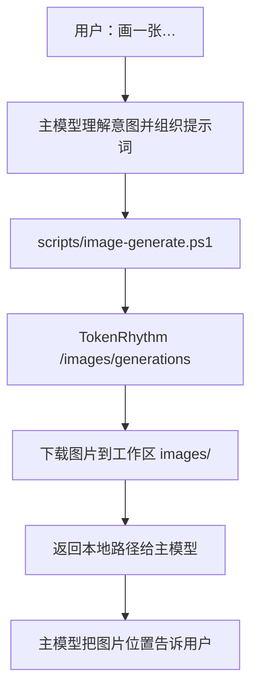

# ds-image-skill

ds-image-skill 是一个为任意聊天模型补充文生图能力的内置技能。它通过基元律动（TokenRhythm）的 OpenAI 兼容生图接口，把用户的一句话提示词变成一张真实的图片，并保存到本地工作区。

支持模型：

- `qwen-image-2.0`（默认，写实与文字渲染均衡）
- `wan2.7-image`（阿里云万相文生图）

## 工作方式



## 图生图（上传原图改图）

底层生图模型只接受文字提示词，因此“照着原图改图”走两步组合流程：

1. 用 ds-vision-skill 识别原图，提取主体、构图、风格、配色、细节等描述；
2. 把原图描述与用户的修改要求合并成完整提示词，再用本技能生成新图。

这是“识图理解 + 文生图”的间接实现，能忠实还原画面主题与风格方向，但无法逐像素保留原图细节；需要严格还原原图（证件照、商标、复杂版式等）时请如实告知用户并建议专业图像编辑工具。

## 自然语言触发

用户不需要记住任何技能名或模型名，直接说人话即可：

- “画一只小猫”“生成一张海报”“帮我做个头像”
- “把这张图的背景换成星空”“把照片变成动漫风格”“给这只猫戴上帽子”

主模型会自动判断意图并完成“识图 → 合并提示词 → 生图”的完整流程。

## 自动打开

生成或改图成功后，脚本会用系统默认看图程序自动打开图片，同时返回保存路径。不需要自动打开时，执行脚本可加 `-NoOpen` 参数。

## 目录结构

```text
ds-image-skill/
  SKILL.md                技能说明（模型按此使用）
  README.md               本项目说明
  config.json             运行时由桌面端自动写入 TokenRhythm Key（不入库）
  scripts/
    image-generate.ps1    生图主入口
    preflight.ps1         配置与依赖检查
    smoke-test.ps1        冒烟自检
```

## 配置

应用内 设置 → 模型 → 生图能力 卡片填写基元律动 API Key，保存后桌面端自动写入本技能的 `config.json`。也可以手动创建：

```json
{
  "tokenrhythm": {
    "apiKey": "sk_tr_...",
    "baseUrl": "https://tokenrhythm.studio/v1"
  }
}
```

## 计费提示

生图按张计费（约 ¥0.2/张），需要基元律动账户余额充足。视觉识图能力使用永久免费模型，与生图互不影响。
