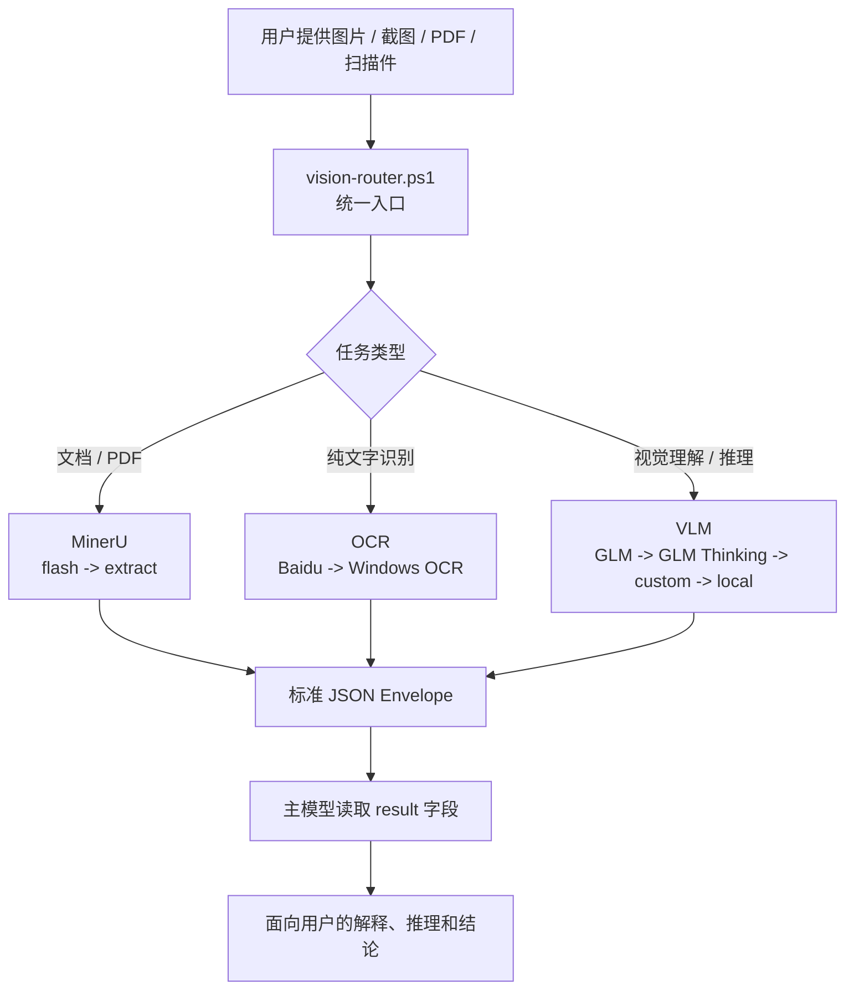

# ds-vision-skill

ds-vision-skill 是一个给纯文本推理模型补充视觉能力的 Codex/DeepSeek skill。它会把图片、截图、扫描件、PDF、图表、UI 截图等视觉输入，转换成文本或标准 JSON，再交给主模型继续分析。

适合这些场景：

- 看图描述、截图分析、UI/代码截图理解
- OCR 文字识别、票据/扫描件文字提取
- 图表、架构图、数学题图片推理
- PDF、论文、报告、表格和公式解析

## 架构图



## 目录结构

```text
SKILL.md
README.md
agents/openai.yaml
references/channels.md
scripts/
  vision-router.ps1      # 推荐入口：自动判断任务并降级
  vlm-vision.ps1         # 视觉理解/推理：glm / glm-thinking / custom / local
  glm-vision.py          # Python OpenSSL 降级调用（schannel TLS 受限时自动使用）
  baidu-ocr.ps1          # 百度 OCR，带 token 缓存
  windows-ocr.ps1        # Windows 离线 OCR
  mineru-extract.ps1     # MinerU 文档解析，带结果缓存
  preflight.ps1          # 通道预检，支持 -Json
  setup.ps1              # 配置 key、状态和验证
  local-select.ps1       # 本地视觉模型选型
```

## 快速开始

先查看可用通道：

```powershell
scripts\setup.ps1 -Status
scripts\preflight.ps1
```

推荐统一入口：

```powershell
scripts\vision-router.ps1 -Path <文件路径> -Prompt "请分析这个文件" -Json
```

指定 OCR：

```powershell
scripts\vision-router.ps1 -Path <图片路径> -Intent ocr -Json
```

指定复杂视觉推理：

```powershell
scripts\vision-router.ps1 -Path <图片路径> -Intent reason -Complex -Prompt "分析这张图表的趋势" -Json
```

指定文档解析：

```powershell
scripts\vision-router.ps1 -Path <PDF路径> -Intent document -Json
```

## 配置云端通道

GLM 视觉模型：

```powershell
scripts\setup.ps1 -SetKey -Channel glm -Key <GLM_API_KEY> -Verify
```

百度 OCR：

```powershell
scripts\setup.ps1 -SetKey -Channel baidu-ocr -Key <BAIDU_API_KEY> -Secret <BAIDU_SECRET_KEY> -Verify
```

OpenAI 兼容自定义中转：

```powershell
scripts\setup.ps1 -SetCustom -BaseUrl <url> -Key <key> -Model <model> -Verify
```

移除配置：

```powershell
scripts\setup.ps1 -RemoveKey -Channel <glm|glm-thinking|baidu-ocr|custom>
```

## 通道说明

| 通道 | 用途 | 环境变量 | 备注 |
|---|---|---|---|
| `glm` | 简单图片理解 | `GLM_API_KEY` | 默认快路径 |
| `glm-thinking` | 复杂视觉推理 | `GLM_API_KEY` | 图表、数学、复杂 UI |
| `custom` | OpenAI 兼容中转 | `VISION_CUSTOM_*` | 私有或第三方服务 |
| `baidu-ocr` | 云端 OCR | `BAIDU_API_KEY` + `BAIDU_SECRET_KEY` | token 自动缓存 |
| `windows-ocr` | 本地 OCR | 无 | 隐私优先、离线兜底 |
| `mineru` | PDF/文档解析 | `MINERU_TOKEN` 可选 | flash 模式优先 |
| `local` | 本地视觉模型 | `VISION_LOCAL_MODEL` 可选 | Ollama/LM Studio/llama.cpp |

> **Python 降级（自动、可选）**：`vlm-vision.ps1` 在原生通道遇到网络/TLS 类错误（退出码 4）且本机有 Python 时，会自动改用 `scripts/glm-vision.py`（Python 自带 OpenSSL，不依赖 Windows schannel）重试同一请求，成功后输出格式与原生路径完全一致（`metadata.python_fallback = true` 可标识）。正常网络环境不会触发；无 Python、降级失败或 401/403/429 等业务错误均保持原行为，不影响其他通道和其他智能体调用。

## 输出格式

所有脚本在 `-Json` 下输出统一结构：

```json
{
  "task_type": "image_reasoning | document_parsing | ocr",
  "tool_used": "actual tool or model",
  "confidence": "high | medium | low",
  "result": "识别、解析或理解后的内容",
  "metadata": {}
}
```

主模型通常只需要读取 `result` 字段继续推理；调试时再查看 `metadata`。

## 缓存策略

- `vlm-vision.ps1` 按图片 hash、prompt、通道和模型缓存结果。
- `baidu-ocr.ps1` 缓存百度 access token，减少重复认证请求。
- `mineru-extract.ps1` 按文件 hash 复用已生成的 Markdown。

缓存位置默认在用户目录下的 `.ds-vision`，以及系统临时目录中的 MinerU 输出目录。

## 隐私提醒

云端通道会把图片或文档发送给对应服务商。处理合同、证件、医疗、财务或其他敏感内容时，建议优先使用 Windows OCR、本地模型，或在发送前取得用户确认。

## 许可证

MIT
